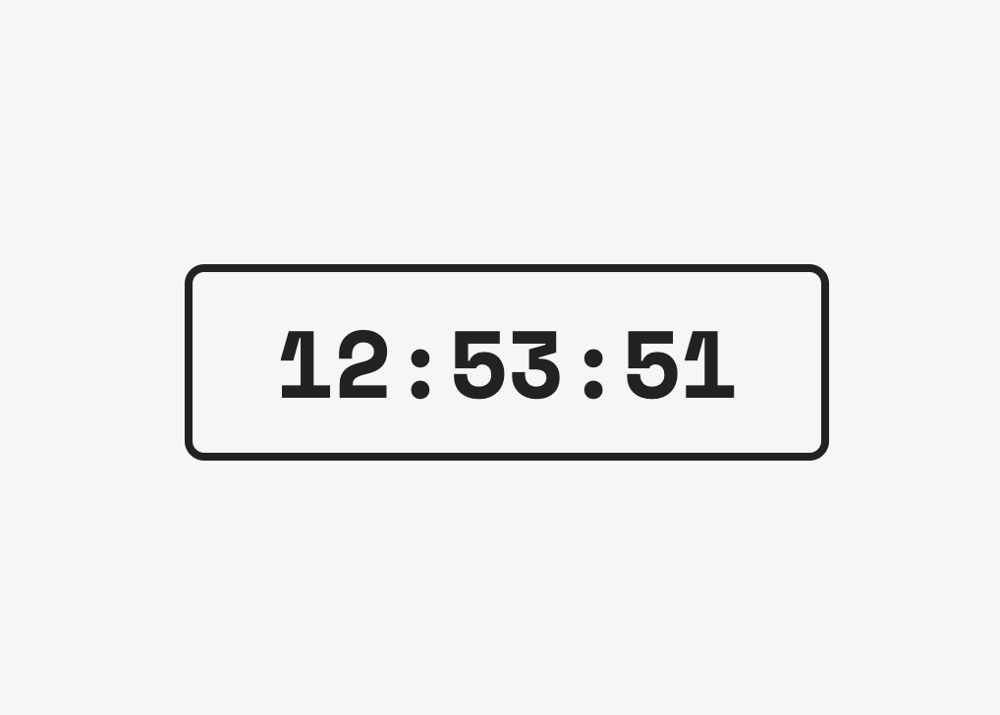

# Digital Clock

A beginner's project to practice JavaScript. To make things a bit more fun, I've implemented a dark and light theme (based on the time of the day).

## Technologies
* HTML
* CSS
* JavaScript
